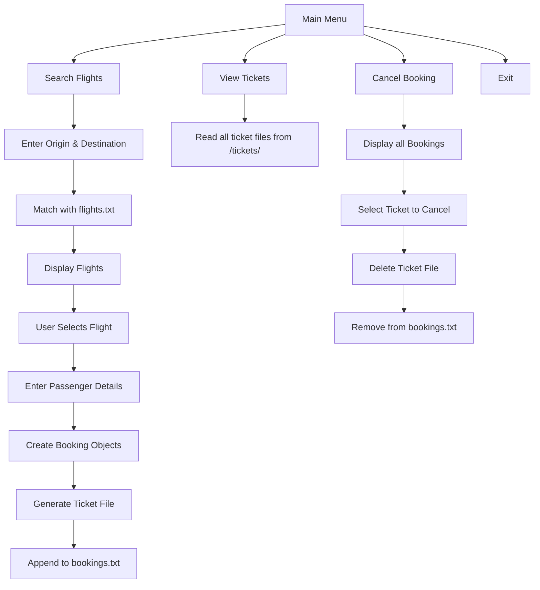

# ✈️ India Airlines - C++ Airline Ticket Booking System

A terminal-based C++ project simulating an airline booking system. Users can search flights, book tickets, generate and view tickets, and cancel bookings. All data is handled using persistent file storage.

---

## 📋 Table of Contents
1. [Features](#features)
2. [Prerequisites](#prerequisites)
3. [Installation](#installation)
4. [Build Instructions](#build-instructions)
5. [Usage](#usage)
6. [Key Concepts Used](#key-concepts-used)
7. [Concept Map / Flowchart](#concept-map--flowchart)
8. [Directory Structure](#directory-structure)
9. [Acknowledgments](#acknowledgments)

---

## ✅ Features

- 🔍 Search available flights by origin & destination
- 🧾 Book tickets for one or more passengers
- 📄 Auto-generates unique ticket files with IDs
- 👥 View all booked tickets
- ❌ Cancel bookings and delete associated ticket file
- 💾 Persistent storage using `bookings.txt` and `ticket_counter.txt`

---

## 📦 Prerequisites

- **C++ Compiler**: GCC version 9.0 or above
- **Operating System**: Windows OS (utilizes `<windows.h>`)
- **Dynamic Link Libraries (DLLs)**:
  - Ensure your environment supports Unicode output for UTF-8 (uses `SetConsoleOutputCP(CP_UTF8)`).

---

## 🛠️ Installation

1. Clone the repository:
   ```bash
   git clone https://github.com/yourusername/airline-booking-cpp.git
   cd airline-booking-cpp
   ```

2. Install GCC (if not already installed):
   - **On Windows**: Install via MSYS2.
   - **On Linux**:
     ```bash
     sudo apt update
     sudo apt install g++
     ```

3. Ensure `flights.txt` exists in the project folder with flight data:
   ```txt
   AI101 Delhi DEL Mumbai BOM 08:00 10:30 3500
   AI102 Mumbai BOM Delhi DEL 11:00 13:30 3600
   ```

---

## 🔧 Build Instructions

1. Compile the project:
   ```bash
   g++ -std=c++17 -o airline_booking airline_booking.cpp
   ```

2. Run the executable:
   ```bash
   ./airline_booking
   ```

3. Ensure that `flights.txt` is in the same directory as the executable.

---

## 🧠 Key Concepts Used

1. **File Handling**:
   - `ifstream`, `ofstream` used for:
     - Reading `flights.txt` (available flights).
     - Writing & reading `bookings.txt` (persistent storage).
     - Creating ticket files in `/tickets/`.
     - `ticket_counter.txt` used to maintain unique ticket IDs across runs.

2. **Inheritance**:
   - `Booking` class inherits from `Flights` to share flight data while adding passenger-specific details.

3. **STL - Vectors**:
   - Used to:
     - Store flights (`std::vector<Flights>`).
     - Handle multiple passengers (`std::vector<Booking>`).
     - Manage multiple bookings (`std::vector<std::vector<Booking>>`).

4. **FileSystem Library**:
   - `#include <filesystem>` to create or check directories.
   - Automatically creates `/tickets/` folder to store ticket files.

5. **Exception & Input Validation**:
   - Prevents crashes by checking input ranges (like flight index, ticket index).
   - Displays appropriate error messages for file or input issues.

---

## 🧭 Concept Map / Flowchart



---

## 📁 Directory Structure

```bash
airline-booking-cpp/
│
├── airline_booking.cpp          # Main source code
├── flights.txt                  # Input flights data
├── bookings.txt                 # Stored bookings
├── ticket_counter.txt           # Keeps count of ticket ID
├── /tickets/                    # Folder containing all ticket files
└── README.md                    # This file
```

---

## 🙌 Acknowledgments

Thanks to the C++ Standard Library, especially:
- `<vector>` for dynamic storage
- `<fstream>` for persistent file handling
- `<filesystem>` for directory & file operations
- `<iomanip>` and `<sstream>` for formatting and ticket generation

Feel free to improve or fork the project and contribute! 😊  
Happy Coding!