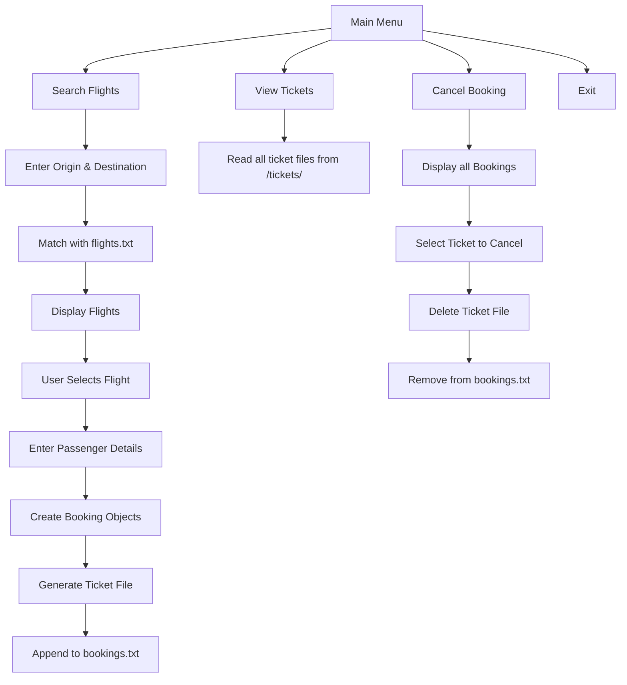

# ✈️ India Airlines - C++ Airline Ticket Booking System

A terminal-based C++ project simulating an airline booking system. Users can search flights, book tickets, generate and view tickets, and cancel bookings. All data is handled using persistent file storage.

---

## 📋 Table of Contents
1. [Features](#features)
2. [Prerequisites](#prerequisites)
3. [Installation](#installation)
4. [Build Instructions](#build-instructions)
5. [Usage](#usage)
6. [Key Concepts Used](#key-concepts-used)
7. [Workflow](#workflow)
8. [Concept Map](#concept-map)
9. [Directory Structure](#directory-structure)
10. [Acknowledgments](#acknowledgments)

---

## ✅ Features

- 🔍 Search available flights by origin & destination
- 🧾 Book tickets for one or more passengers
- 📄 Auto-generates unique ticket files with IDs
- 👥 View all booked tickets
- ❌ Cancel bookings and delete associated ticket file
- 💾 Persistent storage using `bookings.txt` and `ticket_counter.txt`
- 🛠️ Exception handling for robust error management

---

## ✅ Prerequisites

Ensure you have the following installed on your system:

- **GCC/G++ compiler (version 9 or later)**  
  Confirm with:
  ```bash
  g++ --version
  ```

- **DLL dependencies (for Windows builds):**
  These should be in the same folder as the `airlines.exe`:
  - `libstdc++-6.dll`

---

## 🛠️ Installation

1.  **Clone the Repository (if applicable):** If you have the source code in a repository (e.g., Git), clone it to your local machine.

    ```bash
    git clone <repository_url>
    cd IndiaAirlines
    ```

2.  **No Explicit Installation Steps:** This is a standalone C++ application. There's no traditional installation process like installing a package. The executable file (`airlines.exe` on Windows) is the application itself.

## 🔧 Build Instructions

### Using g++ (Direct Compilation)

1.  Open a terminal or command prompt in the directory containing the source file (`main.cpp`).

2.  Compile the `main.cpp` file along with any necessary flags (like linking the filesystem library):

    ```bash
    g++ -std=c++17 main.cpp -o airlines  
    # depending on your compiler and system.
    ```

    On Windows, the output executable will likely be `airlines.exe`. On Linux/macOS, it will be `airlines`.

3.  **Run the executable:**

    ```bash
   ./airlines.exe
    ```

    The executable (`airlines` or `airlines.exe`) will be created in the `build/Release` or `build/Debug` directory.


##  🚀 Usage

1.  **Navigate to the Executable:** Open a terminal or command prompt and navigate to the directory containing the compiled executable (`airlines` or `airlines.exe`).

2.  **Run the Application:** Execute the program.

    ```bash
    ./airlines # On Linux/macOS
    airlines.exe # On Windows
    ```

3.  **Follow the Menu:** The application will display a main menu with the following options:

    ```
    ========= Main Menu =========
    1. Search & Book Flights
    2. View All Tickets
    3. Cancel Booking
    4. Exit
    =============================
    Enter your choice (1-4):
    ```

    Enter the number corresponding to the desired action and follow the on-screen prompts.

## 🧠 Concepts Used

This project demonstrates the following key programming concepts:

* **File Handling (`<fstream>`):**
    * Reading flight data from `flights.txt`.
    * Reading and writing booking data to `bookings.txt`.
    * Managing a counter in `ticket_counter.txt` for generating unique ticket IDs.
    * Creating and writing individual ticket details to files in the `tickets` directory.
* **Vectors (STL - `<vector>`):**
    * Storing lists of `Flights` objects when searching.
    * Holding `Booking` objects for passengers in a single booking.
    * Managing a collection of booking groups.
* **Exception Handling (`<stdexcept>`):**
    * Using `try-catch` blocks to handle potential runtime errors, such as file opening failures, invalid input, or no flights found.
    * Throwing and catching standard exceptions like `runtime_error` and `out_of_range`.
* **Filesystem (`<filesystem>`):**
    * Creating the `tickets` directory if it doesn't exist.
    * Checking if the `tickets` directory is empty.
    * Iterating through the files within the `tickets` directory to display existing tickets.
    * Deleting ticket files when a booking is canceled.
* **Inheritance:**
    * The `Booking` class inherits publicly from the `Flights` class. This allows `Booking` objects to access and utilize the flight details (FlightID, Origin, Destination, DepartureTime, ArrivalTime, FlightPrice) while adding passenger-specific information (PassengerName, Gender, Age, TicketID).
* **String Manipulation (`<string>`, `<sstream>`, `<iomanip>`):**
    * Processing strings for flight origins, destinations, times, and prices.
    * Using `stringstream` to create unique ticket IDs.
    * Employing `iomanip` (specifically `setw` and `left`) for formatted output of flight details.

## 🔄 Workflow

1.  **Application Start:**
    * The program loads any existing booking data from `bookings.txt` into memory.
    * The main menu is displayed to the user.

2.  **Search & Book Flights (Option 1):**
    * The user is prompted to enter the origin and destination.
    * The program reads flight data from `flights.txt` and displays matching flights.
    * The user selects a flight to book.
    * The user enters the number of passengers and their details (name, gender, age).
    * A unique ticket ID is generated.
    * `Booking` objects are created for each passenger.
    * A ticket file (e.g., `ticket_TKT12345.txt`) containing the flight and passenger details is created in the `tickets` directory.
    * The new booking is saved to the `bookings.txt` file.

3.  **View All Tickets (Option 2):**
    * The program checks if the `tickets` directory exists and is not empty.
    * It iterates through each file in the `tickets` directory and displays its content to the user.

4.  **Cancel Booking (Option 3):**
    * The program lists the available bookings (based on the loaded data from `bookings.txt`).
    * The user selects a booking to cancel.
    * The corresponding ticket file in the `tickets` directory is deleted.
    * The booking is removed from the in-memory data and the `bookings.txt` file is updated.

5.  **Exit (Option 4):**
    * The program terminates.

## 🧭 Concept Map



---

## 📁 Directory Structure

```bash
airline-booking-cpp/
│
├── airline_booking.cpp          # Main source code
├── flights.txt                  # Input flights data
├── bookings.txt                 # Stored bookings
├── ticket_counter.txt           # Keeps count of ticket ID
├── /tickets/                    # Folder containing all ticket files
└── README.md                    # This file
```

---

## 🙌 Acknowledgments

This simple flight booking system was developed as a demonstration of basic C++ programming concepts, including file handling, the Standard Template Library (specifically `vector`), exception handling, filesystem operations, and inheritance.

---